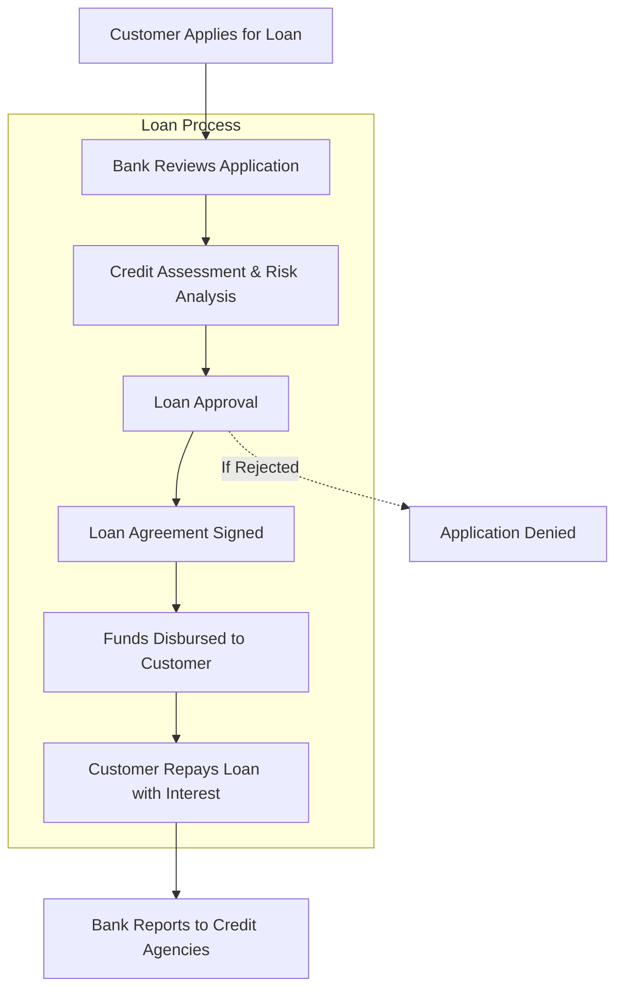

# How Banks Lend Money in Europe

```mermaid
graph TD
    A[Customer Applies for Loan] --> B[Bank Reviews Application]
    B --> C[Credit Assessment & Risk Analysis]
    C --> D[Loan Approval]
    D --> E[Loan Agreement Signed]
    E --> F[Funds Disbursed to Customer]
    F --> G[Customer Repays Loan with Interest]
    G --> H[Bank Reports to Credit Agencies]
    D -.->|If Rejected| I[Application Denied]

    subgraph Loan Process
        B
        C
        D
        E
        F
        G
    end
```

This diagram summarizes the typical process for how banks lend money in Europe, from application to repayment and reporting.