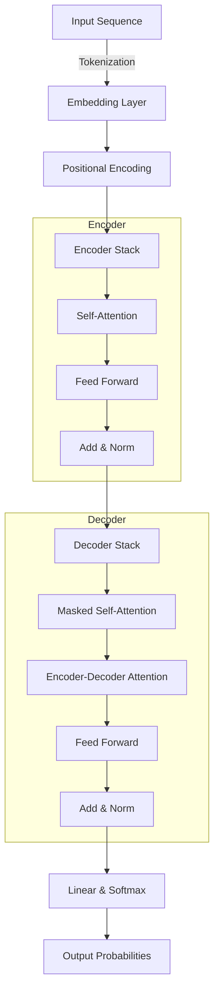
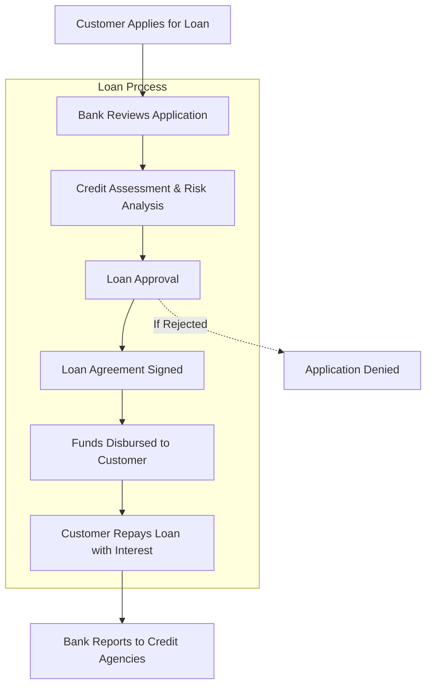

# Transformers Model - How It Works

This diagram illustrates the main flow of a transformer model, showing the encoder and decoder stacks, attention mechanisms, and how input is transformed into output probabilities.

---

# How Banks Lend Money in Europe

This diagram summarizes the typical process for how banks lend money in Europe, from application to repayment and reporting.